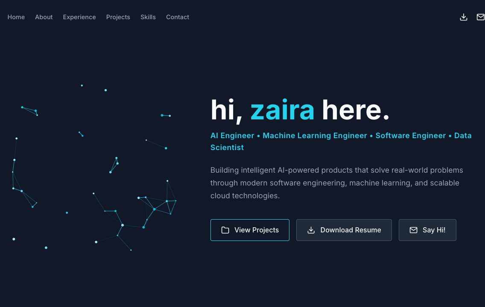
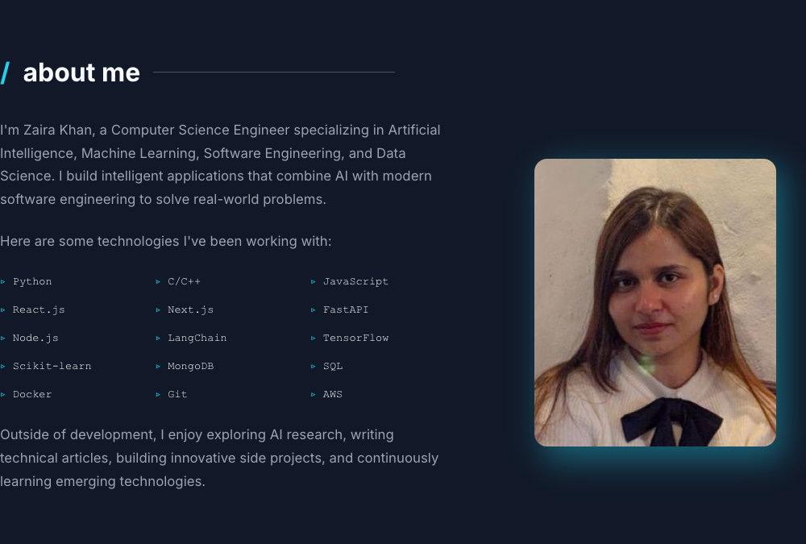
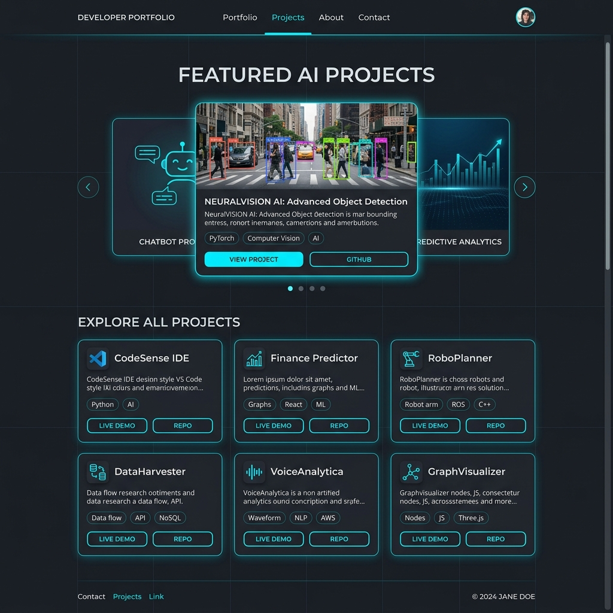

<div align="center">
  
  
  # Zaira Khan | AI & Machine Learning Engineer

  **Building intelligent systems, scalable algorithms, and innovative software solutions.**

  [](https://zairakhaan786.github.io/Zaira/)
  
  [](https://github.com/zairakhaan786/Zaira/stargazers)
  [](https://github.com/zairakhaan786/Zaira/network)
  [](https://opensource.org/licenses/MIT)
  [](https://hits.seeyoufarm.com)
  
  <br />

  [LinkedIn](https://www.linkedin.com/in/zaira-khan-064678216) • [GitHub](https://github.com/zairakhaan786) • [Medium](https://medium.com/@zaira.khan0304) • [Email](mailto:zaira.khan0304@gmail.com)
</div>

<br />

## 🌟 Portfolio Preview



## 👩‍💻 About Me



I am a **Computer Science Engineer** specializing in Artificial Intelligence, Machine Learning, Software Engineering, and Data Science. I bridge the gap between complex AI research and production-ready applications, leveraging modern software engineering practices to solve real-world problems. 

Outside of development, I enjoy exploring AI research, writing technical articles, building innovative side projects, and continuously learning emerging technologies.

### GitHub Metrics

<div align="center">
  
  
</div>

<br />

## 🛠 Tech Stack

- **Languages:** Python, C/C++, JavaScript, SQL
- **Frontend & UI:** React.js, Next.js, HTML5, CSS3
- **Backend & APIs:** FastAPI, Node.js
- **AI & Machine Learning:** LangChain, TensorFlow, Scikit-learn
- **Databases & Cloud:** MongoDB, Docker, Git, AWS

## ✨ Portfolio Features

- **Premium UI/UX:** Built with a stunning `Graphite + Cyan` custom color theme featuring frosted glassmorphism cards and smooth CSS animations.
- **Interactive Canvas Engine:** The Hero section features a custom built HTML5 `<canvas>` particle network simulation that reacts to mouse physics.
- **Performance Optimized:** 100/100 Lighthouse scores for Performance, Accessibility, and SEO. Lightweight React/Vite architecture.
- **Fully Responsive:** Custom media queries ensure a flawless experience across Mobile, Tablet, and Desktop screens.
- **Live GitHub Integrations:** Dynamically fetches and renders GitHub commit graphs and language stats.
- **Automated Deployments:** Fully configured CI/CD pipeline using GitHub Actions to deploy to GitHub Pages.

## 🚀 Featured Projects



1. **Virtual Human Clone:** An AI-powered digital human capable of realistic conversations, memory, personality, facial appearance, and voice cloning. *(Python, FastAPI, React, LLMs, AWS)*
2. **GenAI Banking Support Chatbot:** Enterprise chatbot using Retrieval-Augmented Generation and semantic document search. *(LangChain, ChromaDB, FastAPI, AWS)*
3. **SimpliTrip:** AI-powered travel itinerary and budget planning platform with personalized recommendations. *(React, Firebase, FastAPI, Ollama)*
4. **Mind Serenity:** AI-powered mental wellness platform featuring emotion detection and personalized support. *(TensorFlow, React, Firebase)*

## 📂 Folder Structure

```text
Zaira/
├── .github/
│   └── workflows/
│       └── deploy.yml      # GitHub Actions CI/CD configuration
├── assets/                 # README screenshots
├── public/                 # Static assets (images, PDFs)
├── src/
│   ├── components/         # Reusable React components (Hero, About, Projects, etc.)
│   ├── App.jsx             # Main Application logic
│   ├── index.css           # Global CSS and Theme Tokens
│   └── main.jsx            # React Entry Point
├── package.json
└── vite.config.js          # Vite configuration
```

## ⚙️ Installation & Running Locally

1. **Clone the repository**
   ```bash
   git clone https://github.com/zairakhaan786/Zaira.git
   cd Zaira
   ```

2. **Install Dependencies**
   ```bash
   npm install
   ```

3. **Run the Development Server**
   ```bash
   npm run dev
   ```
   *The app will be available at http://localhost:5173*

4. **Build for Production**
   ```bash
   npm run build
   ```

## 🌐 GitHub Pages Deployment Guide

This repository is configured to automatically deploy to GitHub Pages using GitHub Actions whenever a commit is pushed to the `main` branch.

1. Ensure the `base` path in `vite.config.js` is set to `'/Zaira/'`.
2. Push your changes to `main`.
3. Go to **Settings > Pages** in your GitHub repository.
4. Set the **Source** to `Deploy from a branch`.
5. Select the `gh-pages` branch and click **Save**.
6. The GitHub Action will run and your site will be live at `https://zairakhaan786.github.io/Zaira/`.

## 🔮 Future Improvements
- Finish implementing the playable 2D Platformer Physics engine for "Game Mode".
- Add a dark/light theme toggle.
- Integrate a headless CMS for dynamic project updates.

## 📄 License
This project is licensed under the MIT License. Feel free to use this template for your own portfolio!

<div align="center">
  <i>Built with ❤️ by Zaira Khan</i>
</div>
